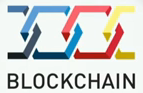

## Cos'è Blockchain

Super attributi:

* **Trasparente**
* **Immutabile**
* **Permanente**
* **Autonomo**
* **Affidabile**
* **Decentralizzato**

Selezione da TED:

* Blockchain technology : From Hype to Reality | Russel E. Perry | TEDxMünster
* Blockchain, the future of money | Nicolas Cary | TEDxManchester
* How the US government is using blockchain to fight fraud | Kathryn Haun | TEDxSanFrancisco
* Blockchain is Eating Wall Street | Alex Tapscott | TEDxSanFrancisco
* The Value Revolution: How Blockchain Will Change Money & the World | Galia Benartzi | TEDxWhiteCity
* How the blockchain will radically transform the economy | Bettina Warburg
* At the Speed of Money: How Cryptocurrency Will Transform Everything | David Morris | TEDxTampaBay 
* The future will be decentralized | Charles Hoskinson | TEDxBermuda
Blockchain: Más allá del bitcoin | José Juan Mora | TEDxSevilla

### Ulteriori Proprietà

* **Innovazione Tecnologica**
* **Persistenza nel Tempo**

Ammesso e non concesso che la innovazione sia una proprietà positiva, non lo è _per se_, ma solo se destinata a perdurare nel tempo e a migliorare la condizione umana comune.

Alcune tecnologie sono epocali: _stampa_, _motori a combustione_, _computers ed Internet_.
La misura è la perdita: quale sarebbe la profondità della crisi umana se una determinata tecnologia venisse a mancare.

Prima di affrontare spensieratamente l'adozione di una nuova tecnologia, dovremmo forse chiederci quale grado di dipendenza causerà, e se sia possibile rimpiangere il momento precedente.
