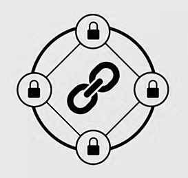

## Cos'è Blockchain

Super attributi:

* **Trasparente**
* **Immutabile**
* **Permanente**
* **Autonomo**
* **Affidabile**
* **Decentralizzato**

Selezione da TED:

* Blockchain technology : From Hype to Reality | Russel E. Perry | TEDxMünster
* Blockchain, the future of money | Nicolas Cary | TEDxManchester
* How the US government is using blockchain to fight fraud | Kathryn Haun | TEDxSanFrancisco
* Blockchain is Eating Wall Street | Alex Tapscott | TEDxSanFrancisco
* The Value Revolution: How Blockchain Will Change Money & the World | Galia Benartzi | TEDxWhiteCity
* How the blockchain will radically transform the economy | Bettina Warburg
* At the Speed of Money: How Cryptocurrency Will Transform Everything | David Morris | TEDxTampaBay 
* The future will be decentralized | Charles Hoskinson | TEDxBermuda
Blockchain: Más allá del bitcoin | José Juan Mora | TEDxSevilla
