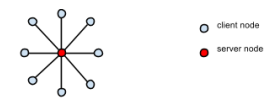
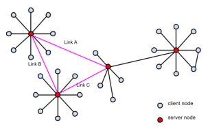
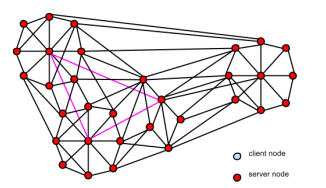

## Sistemi Distribuiti

Quello dei sistemi distribuiti è un paradigma computazionale ormai molto affermato.
Un sistema distribuito è costituito da _nodi_ di rete che si interscambiano _messaggi.

Sono possibili tre topologie di rete:

1. **Centralizzata**
Un **Server** centrale interagisce con _n_ **Clients**.
Isolata e non resiliente: punto singolo di fallimento.

2. **Decentralizzata**
Più reti centralizzate sono interconnesse tra loro. Esempio: _Internet_ moderna.
Alquanto resiliente: possibilità di _sezionamento_ in sottoreti irraggiungibili.

3. **Distribuita**
Il numero di interconnessioni è molto elevato, almeno 3 per ogni nodo. Internet futura.
Molto resilente.
