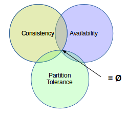

## Il Teorema CAP

Congettura di _Eric Brewer_ (1998), comprovato da _Seth Gilbert_ e _Nancy Lynch_ (2002).

Un sistema distribuito può avere al massimo due delle seguenti tre proprietà desiderabili:
* **Consistenza** (_Consistency_) - tutti i nodi possiedono la stessa copia dei dati
* **Disponibilità** (_Availability_) - l'intero sistema è accessibile e funzionante
* **Resilienza al Partizionamento** (_Partition Tolerance_) - se un sottoinsieme fallisce, il rimanente continua a funzionare correttamente

Il Blockchain tenta di superare questo teorema, con successo vario:
* _Consistenza_ : algoritmi di **consenso**
* _Disponibilità_ : **State Machine Replication**
* _Resilienza_ : tolleranza a **Nodi Bizantini**
