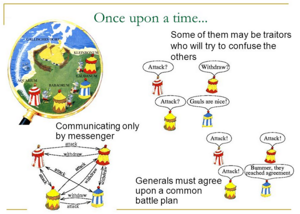

## Generali Bizantini

Un nodo può fallire totalmente o parzialmente per due motivi:
* **accidentale** - per cause 'naturali' o errori software
* **intenzionale** - per comportamento malefico dell'amministratore del nodo

Un nodo con comportamento irrazionale o imprevedibile si chiama **Nodo Bizantino**.

Preso da un esperimento di pensiero (_Gedankexperiment_): più _Generali Bizantini_ devono attaccare una città nemica e devono comunicare tra loro per mettersi daccordo sui tempi e le modalità.
Non solo il canale di comunicazione è ostile, ma qualcuno dei generali può essere un traditore.

Svariati teoremi matematici dimostrano il numero massimo di **Nodi Bizantini** accettabile con vari algoritmi di **Consenso**.

Problema risolto nel 1999 da _Castro_ e _Liskov_: **Practical Byzantine Fault Tolerance** (PBFT).