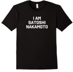

## Electronic Cash

La storia è ancora corta, ma sta velocemente divenendo romanzata.
Alcuni degli attori principali sono:

#### David Chaum (1984): **Digicash** (_eCash_)

* **Blind Signature**: firma elettronica di conferma del _cash token_ senza conoscenza del contenuto
* **Registry** centralizzato per impedire la spesa doppia
* **Comunicazione Anonima** (_mix networks_)

#### Adam Back (1997): **hashcash**

* Originariamente per impedire _mail spamming_
* **Pricing Functions** : problemi con costo computazionale discreto da risolvere prima di avere accesso ad una risorsa (_Cynthia Dwork_ e _Moni Naur_)
* Alla base del concetto di **Proof-of-Work**

#### Wei Dai (1998): **b-money**

* Introdotta la rete _peer-to-peer_ con replica dei dati su tutti i nodi

#### Nick Szabo (2005): **BitGold**

* Introduce il concetto di **Smart Contracts** come valore distribuibile oltre al denaro elettronico

#### Hal Finney (2005) 

Forse il creatore incognito di Bitcoin

* Combinazione delle idee precedenti, ma ancora un'autorità centrale
* Morto 2014 di ALS, criogenicamente preservato

#### Satoshi Nakamoto (2009): **Bitcoin**

* Persona fittizia e pseudonima
* Tutte le idee precedenti, più il **Blockchain**

### Note

Il denaro elettronico è stato, almeno originariamente, fortemente osteggiato dalle autorità nazionali, particolarmente americane, a causa delle sue proprietà intrinseche:
* viola la prerogativa _Reale_ di battere moneta
* se anonimo, permette attività illegali
    * evazione fiscale
    * riciclaggio
    * pagamenti per oggetti o servizi illegali
* non è gravato da debiti
* non è gestito da _Banche Centrali_
