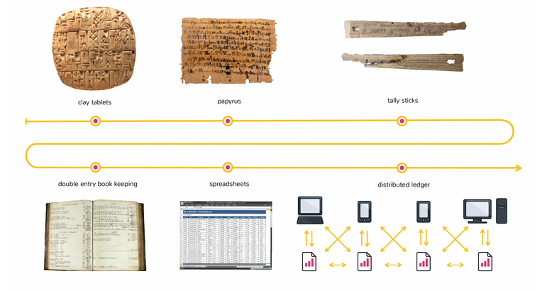

## Ledger

In ambito di Contabilità il vocabolo inglese _ledger_ corrisponde a _Prima Nota_ o _Libro Mastro_.

In contesto di Blockchain possiamo meglio parlare di **Registro** o **Archivio di Protocollo**.

E' un database con un'unica tabella, di dimensione potenzialmente infinita e scrivibile solo in modalità **append**.

Il ledger di Blockchain è **distribuito** ad una certa quantità di nodi di rete. Possiamo distinguere due tipi di nodi:
* **Full Nodes** - che contengono una copia dell'intero ledger
* **Client Nodes** - che non lo contengono, p.es. Smartphone, ecc.

Sia i nodi pieni che i client possono eseguire transazioni, possedendo sufficiente criptovaluta sia per le transazioni che i costi aggiuntivi d'esercizio. Le transazioni sono compiute tramite un programma client, il **Wallet**.

Il nodo pieno può occuparsi dell'attività detta **mining** cioè contribuire:
* alla verifica delle transazioni
* al tentativo di costruzione di nuovi blocchi

### Sequenza di Operazioni

La sequenza di estensione del Ledger è la seguente:

1. Un nodo inizia una transazione e la firma con la sua chiave privata
2. La transazione è propagata a molti nodi tramite protocolli broadcast, effettivamente inserita in un _pool_ distribuito di transazioni pendenti.
3. Più di un nodo verifica la validitàdella transazione.
4. Più nodi _miner_ inseriscono la transazione in un blocco in costruzione.
5. Il meccanismo di consenso decide quale dei blocchi in costruzione alternativi è l'unico accettabile.
6. Il blocco è aggiunto al Blockchain ed estende il Ledger. La transazione può ritenersi confermata, anche se molte implementazioni preferiscono attendere ancora la generazione di altri blocchi successivi.

