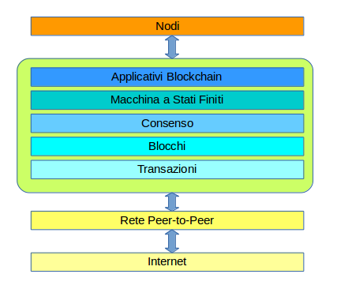

## Modello Software

Blockchain può essere visto come un livello in un modello di comunicazione distribuita peer-to-peer e a sua volta basato sulla rete Internet.

Blockchain stesso è composto di più sottolivelli:
* **Transazioni**
* **Blocchi**
* **Consenso**
* **Macchina a Stati finiti**
* **Applicazioni**