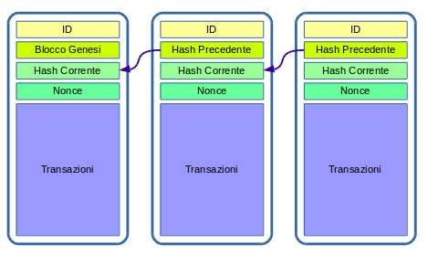

## Struttura di un Blocco

Un blocco è essenzialmente una selezione di transazioni riunite insieme in modo logico, e corredato di campi amministrativi extra, il cui numero e struttura dipemdono dall'implementazione specifica.

Ogni blocco ha un campo che contiene lo _hash_ del blocco precedente, formando così un anello della catena.

Il primo blocco non ha questo riferimento: è il **Blocco Genesi**.