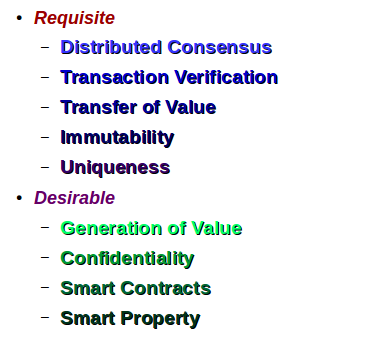

## Proprietà del Blockchain

Tutte le implementazioni di Blockchain forniscono le seguenti proprietà _requisite_:

* **Consenso Distribuito**
    * Accordo su un unico stato del Blockchain.

* **Verifica delle Transazioni**
    * Solo transazioni valide vengono inserite nel Blockchain.

* **Trasferimento di Valore**
    * Le transazioni trasferiscono valore tra indirizzi identificativi.

* **Immutabilità**
    * Il Blockchain non è modificabile in pratica.

* **Univocità**
    * Ogni transazione compare una sola volta. Questo evita, per esempio, la doppia spesa.

In aggiunta possono esservi le ulteriori proprietà, che non sono però da considerarsi _requisite_, ma _desiderabili_:

* **Generazione di Valore**
    * Può venir generata nuova _criptovaluta_.

* **Confidenzialità**
    * Si può evitare di rivelare l'identità dei partecipanti alle transazioni.

* **Smart Contracts**
    * Possono venir registrate azioni condizionali da intraprendere automaticamente.

* **Smart Property**
    * Può venir registrata l'associazione indubitabile di un _asset_ ad un indirizzo, e quindi al detentore della chiave privata che può gestire quell'indirizzo.

### Proprietà Generale Primaria

Un Blockchain è controllabile solo da chi detiene almeno più del 50% del meccanismo generatore del consenso.
Questa possibilità è evidentemente da evitare accuratamente nel design implementativo.

Non c'è bisogno in tal caso di nessuna autorità terza o _super partes_ per garantire le proprietà di un Blockchain.
