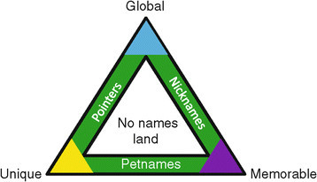

## Triangolo di Zooko

Il teorema di _Zooko Wilcox-O'Hearn_ parla delle proprietà dei **Naming Systems** in generale. 
I requisiti di un nome sono:
* **Sicuro** - non cambiabile senza la dovuta autorità
* **Decentralizzato** - senza un elemento radice di controllo
* **Significativo** - per gli esseri umani, per esempio facilmente ricordabile

L'asserzione di Zooko è che sono possibili solo due di queste proprietà.

Esempi.
* **DNSSec** è sicuro e significativo ma non decentralizzato
* indirizzi **Onion** Routing (_Tor_) e **Bitcoin** sono sicuri e decentralizzati, ma incomprensibili agli umani

Ora esistono più soluzioni al Triangolo di Zooko.
