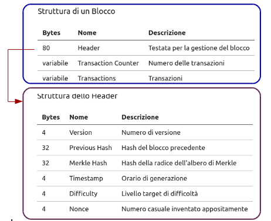
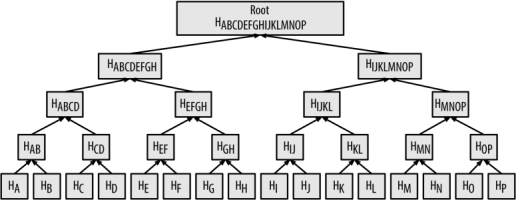

## Proprietà

Bitcoin è software Open Source con licenza MIT, reperibile a `https://github.com/bitcoin/bitcoin`. E' scritto in C++.

### Struttura di un Blocco

| Bytes | Nome | Descrizione |
| -- | -- | -- |
| 80 | Header | Testata per la gestione del blocco |
| variabile | Transaction Counter | Numero delle transazioni |
| variabile | Transactions | Transazioni |

La dimensione massima di un blocco è 1 Megabyte.

### Struttura dello Header

| Bytes | Nome | Descrizione |
| -- | -- | -- |
| 4 | Version | Numero di versione |
| 32 | Previous Hash | Hash del blocco precedente |
| 32 | Merkle Hash | Hash della radice dell'albero di Merkle |
| 4 | Timestamp | Orario di generazione |
| 4 | Difficulty | Livello target di difficoltà |
| 4 | Nonce | Numero casuale inventato appositamente |

### Merkle Tree

Il _Merkle Hash_ punta al nodo radice di un Albero di Merkle in cui sono organizzate le transazioni.