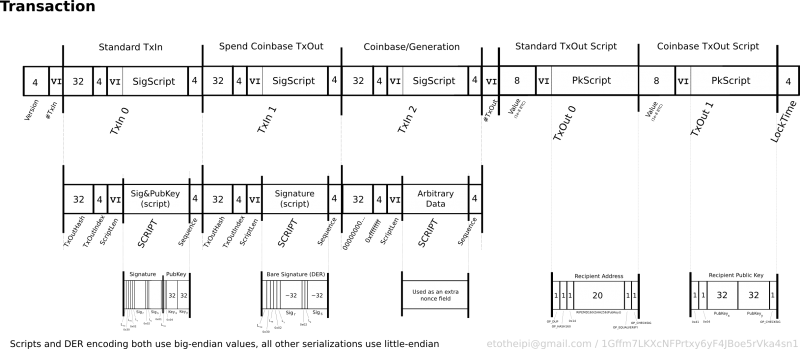

## Transazioni

Formato generale di una transazione:

| Bytes | Nome | Descrizione |
| -- | -- | -- |
| 4 | Version | Correntemente 1 !
| 1-9 | In Counter | Numero di transazioni di input |
| variabile | Inputs | Lista degli inputs |
| 1-9 | Out Counter | Numero di transazioni di output |
| variabile | Outputs | Lista degli outputs |
| 4 | Lock Time | Prima della finalizzazione della transazione |

Il `Lock Time` indica il numero di blocchi o il timestamp del blocco prima che la transazione possa considerarsi valida.

Valida vuol dire che può essere spesa.

La prima transazione si chiama **Coinbse** e non è considerata valida se non sono stati prodotti almeno 100 blocchi.

Una transazione può avere più inputs e più outputs.

Struttura di un input (esempio):
```
Input:
Previous tx: f5d8ee39a430901c91a5917b9f2dc19d6d1a0e9cea205b009ca73dd04470b9a6
Index: 0
scriptSig: 304502206e21798a42fae0e854281abd38bacd1aeed3ee3738d9e1446618c4571d10
90db022100e2ac980643b0b82c0e88ffdfec6b64e3e6ba35e7ba5fdd7d5d6cc8d25c6b241501
```

Viene importato valore dall'output di indice `0` nella transazione di hash `f5d8...`. Il campo `scriptSig` è una procedura codificata per la verifica della firma del generatore della transazione - un algoritmo crittografico complesso.

Nella stessa transazione è incluso un output (esempio):
```
Output:
Value: 5000000000
scriptPubKey: OP_DUP OP_HASH160 404371705fa9bd789a2fcd52d2c580b65d35549d
OP_EQUALVERIFY OP_CHECKSIG
```

Vengono inviati 50 BTC (5000000000 Satoshi) all'indirizzo esadecimale `4043...`, con ulteriori flags di specifica di trattamento.

I valori sono indicati in `Satoshi` (1 Bitcoin = 100.000.000 Satoshi) per costringere l'uso di un numero intero.

Vi sono tipi diversi di transazioni, con diversa struttura.


