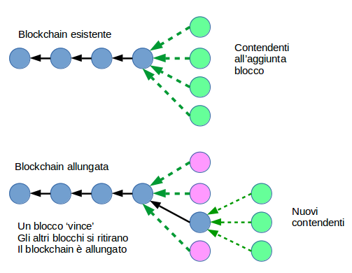
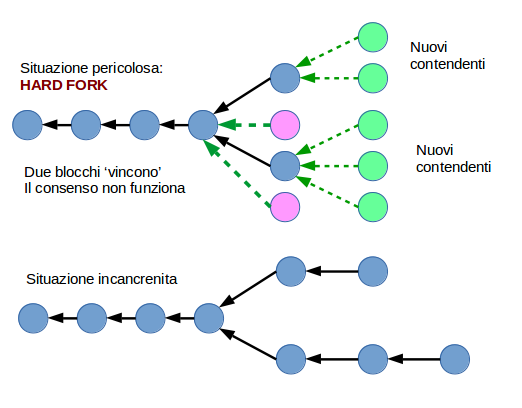

## Blockchain

I blocchi sono aggiunti al Blockchain solo dopo verifica multipla delle transazioni e solo se queste fanno parte del blocco che ottiene il consenso.

Il consenso è basato sul metodo **Proof of Work**.
Occorre trovare un **Nonce** che, insieme al resto del blocco, produca uno hash inferiore ad un valore determinato. L'unico metodo possibile è basato su tentativi di cambiare il _Nonce_ (**Forza Bruta**).

Il campo **Difficoltà** esprime il valore minimo dello hash target.
La Difficoltà viene cambiata a intervalli regolari, nel tentativo di ottenere un nuovo blocco ogni circa 10 minuti.

Il _miner_ del blocco vincente riceve come compenso alcuni Ether. Il compenso per nuovi blocchi diminuisce col tempo, al momento è di BTC 12.50. Il miner percepisce anche un _transaction fee_ da ogni transazione finalizzata.

Le transazioni proposte risiedono temporaneamente in un **Transaction Pool** finchè non si vedono inserite nel blocco vincente. Se una transazione offre un _fee_ appetibile può venir considerata da più _miners_ nei loro tentativi di generazione blocchi, quindi ha più probabilità di successo.

#### Stale Block

Quando un blocco _vince_ e viene accettato per l'aggiunta al Blockchain, tutti gli altri miners si trovano ad avere **Stale Blocks**: li abbandonano e ricominciano nella 'gara' col prossimo blocco.

#### Orphan Blocks

Hanno passato il requisito di difficoltà (hash inferiore al minimo), ma prima di venire accettati viene offerto un altro blocco valido con difficoltà maggiore (hash inferiore). 

Le transazioni nei Blocchi Stale od Orfani non vengono confermate.

#### Il Blocco Genesis

E' il primo blocco del chain e le sua struttura è bruciata nel codice.

### Fork

In caso di offerta di due blocchi validi viene scelto quello con difficoltà maggiore.

Se la rete è partizionata al momento della scelta, ciascuna partizione può effettuare una scelta _ragionevole_ maa condotta nell'ignoranza dell'altra partizione.
Come conseguenza otteniamo due Blockchains accettati, una **Fork**.

Blockchain si basa sul principio della **Eventual Convergence**.
Quando il partizionamento termina e tutta la rete è visibile, il ramo del Fork con difficoltà minore viene rifiutato, e tutti i suoi blocchi divengono Orfani.

Si raccomanda in Bitcoin di non considerare le transazioni confermate, cioè spendibili, se non sono stati aggiunti un certo numero di blocchi, tipicamente 4.

Se per cause incidentali o dolose, abbiamo un fork e le transazioni di entrambi i rami sono state spese, abbiamo una situazione di **Hard Fork**, da cui è molto difficile uscire:
* o un branch del fork viene totalmente sacrificato
* oppure bisogna generare un intero nuovo Blockchain indipendente e separato dal precedente.

Il problema è tipico di tutti i sistemi di Controllo Versione basati su DAG (_Directed Acyclic Graph_) come Git. I **Fork** (_branch_ in Git) sono facili, i **Merge** possono essere difficili, e richiedono sacrificio di codice.

In Bitcoin i _Merge_ non sono possibili.

Nei sistemi di consenso basati sul voto, consorzi che controllino il 50%+1 dei voti possono imporre un Fork.

