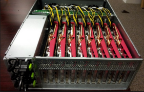

## Bitcoin Mining

Il _mining_ è un'attività computazionalmente intensiva e richiede un investimento in hardware piuttosto notevole.
Visto il dispendio di calore e la necessità di raffreddamento, occorre valutare anche il costo dell'energia elettrica.

L'evoluzione dei dispositivi di mining, in particolare per _Bitcoin_ è stata come segue.

### CPU

All'inizio (2008) bastava anche un Desktop per il mining, poichè le difficoltà erano basse. Non è più il caso.
Per un breve periodo si è ricorsi all'_overclocking_ di CPU.

---

### GPU

L'utilizzo di _Graphical Processing Units_, come nelle schede grafiche NVidia, permetteva di svolgere operazioni in parallelo.
Presto sono stati introdotti sul mercato arrays di GPU dedicate e concepiti proprio per il Bitcoin Mining.

---

### FPGA

I _Field Programmable Gate Arrays_ sono stati la soluzione successiva.
Questi richiedono però la conoscenze di determinati linguaggi di programmazione, come VHDL, e competenze nello sviluppo _embedded_.

---

### ASIC

Gli _Application Specific Integrated Circuits_ contengono i programmi per lo hash SHA-250 direttamente nel microcodice, e gli ASICs non sono in grado di fare altro oltre quello per cui sono stati costruiti.
Varie ditte commerciali hanno offerto ASICs per il Bitcoin Mining.

---

### Mining Pools

Con le _difficoltà_ correnti i singoli individui non sono più competitivi. Sono state create strutture con la complessità e potenza di un centro di calcolo moderno, interamente dedicate al mining.
Il singolo utente sottoscrive una quota ad un _Mining Pool_ e riceve un profitto proporsionale all'investimento ogni volta che questa ha successo nella produzione di un nuovo blocco.

---

### Concorrenza

I Mining Pools tendono ad avere successo proporzionale alla loro dimensione. Nel tempo i Mining Pools presenti sul mercato si sono ridotti notevolmente di numero.
Esiste il pericolo potenziale, se uno di loro conquista la maggioranza di successi, che possa imporre uno **Hard Fork** a proprio vantaggio.
Bitcoin tenta di impedire questo aspetto variando il livello di difficoltà. Altri Altcoins adottano strategie appropriate.

---

### Consumo Elettrico

Il consumo globale di energia nel mining del solo Bitcoin è enorme ed in cresita accelerata.
Ad oggi consuma come la Slovenia (2 milioni di abitanti), per il 2020 consumerà come la Danimarca (5 milioni e mezzo di abitanyi). Consuma ad oggi come 50 volte l'intero circuito Visa.

Il consumo di energia non è dato solo da Bitcoin, ma da tutti gli Altcoins simili. Per esempio _Ethereum_ consuma al momento circa un quito di quanto faccia Bitcoin, ovvero come il Nicaragua (6 milioni di abitanti).

Secondo molti **Profit Calculators** disponibili in rete, l'investimento in mining da parte di grossi _pools_, da ancora al giorno d'oggi notevoli margini di profitto, specialmente considerando l'accelerazione della valutazione del Bitcoin negli ultimi mesi. Il costo dell'elettricità per produrre un Bitcoin è sceso in tre mesi dal 90% al 60% del valore del Bitcoin.

Questo produrrà un ulteriore aumento del consumo elettrico rispetto alle precedenti stime.

E' l'effetto _Regina Rossa_ di _Alice nel Paese delle Meraviglie_:
bisogna continuare a correre più forte solo per rimanere al passo.

Robert Hillard (Deloitte Consulting, Australia) stima che il costo elettrico medio di una transazione Bitcoin media sia equivalente a quello sostenuto per la spesa elettrica di una casa australiana e mezzo per ventiquattrore.

