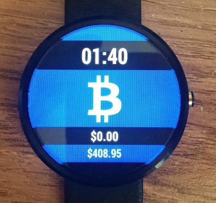
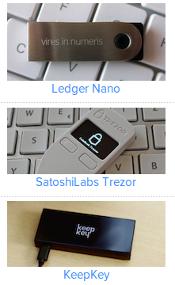
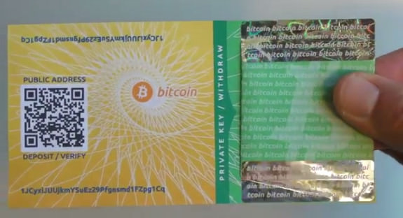
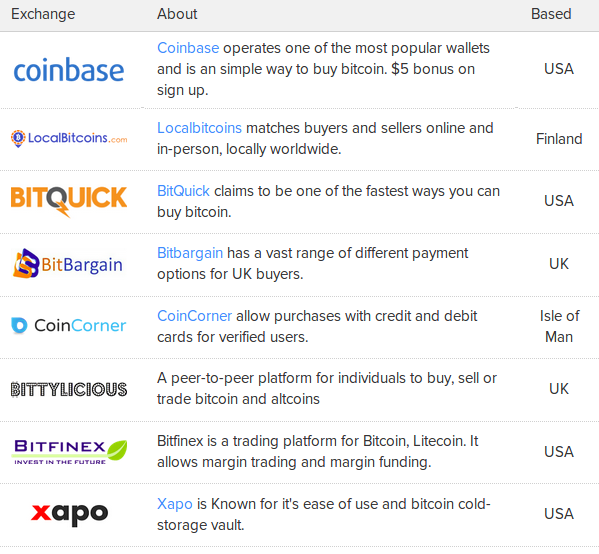
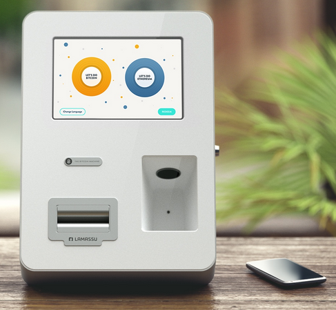

## Bitcoin in Pratica

### Organizzare un Wallet

#### Software sul PC, Smartphone, Tablet o Wearables

Può essere il solo Wallet (client) o associato a un nodo pieno, capace (potenzialmente) di mining.

#### Online Wallets

Spesso associati ad Exchanges.

#### Dispositivi Hardware

#### Paper Wallet

### Come comprare Bitcoins

#### Tramite un Exchange

#### Over-the-Counter

A volte vi sono stalls in luoghi pubblici per il trading di Bitcoins ma questo capita più che altro in città mondiali e di rado. Tali eventi si possono ricercare su: `http://www.meetup.com`.

Più comunemente vi sono _bacheche online_ per il contatto diretto tra acquirente e venditore.

Per esempio: `https://localbitcoins.com/`.

#### Mining

Veramente è necessario iscriversi ad un 'mining pool'.

#### Fondi di Investimento

Destinati ad investitori professionali, non al mercato retail.

Esempi:
Bitcoin Investment Trust

Winklevoss Exchange Traded Fund

#### Bancomat (ATM)

In alcuni paesi sono illegali, p.es. Germania.
Sono simili ad ATM bancari. Si inserisce la valuta e
* o viene visualizzato il codice QR da scandire ed acquisire
* o viene stampato un foglio cartaceo col codice appropriato

Locazioni fornite da: `https://coinatmradar.com/`, al 16/06/2017:

Talent Garden, Via Merano 16, Milano - chiosco antico
Impact Hub, Via Roberto da Sanseverino, Trento
Manialcielo Pub, Piazza Malfatti 27, Rovereto
Renaissainces Social, Teatro Juvarra, Torino
Viva! srl, Via W. Fillak 263r, Genova
Computer Shop snc, Via Guidiccioni 2, Pisa

Come paragone, nel Regno Unito ve ne sono 76, 49 dei quali a Londra.

