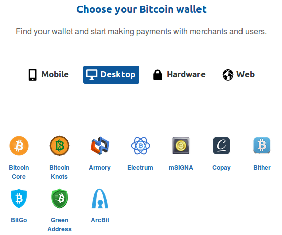

## Wallets

Installazione

Disponibile su `https://bitcoin.org/en/choose-your-wallet`

Vi sono numerosi wallet disponibili con caratteristiche diverse.

Per esempio installazione per Desktop Linux del Wallet Bitgo.

