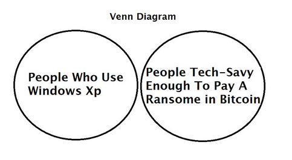

## Aspetti Legali

Bitcoin e il suo coinvolgimento in casi di _Ransomware_ ha causato un notevole incremento per gli aspetti legali delle criptovalute, e del Blockchain in generale, che prima intorpidivano nel dormiveglia di interesse della Giurisprudenza tradizionale.

Vediamo alcune tipiche domande, gettonate in Internet.
Va notato che viene descritta la situazione corrente, medio 2017, che può velocemente cambiare.

#### Vi sono paesi in cui Blockchain è proibito?

Blockchain _per se_ è una tecnologia generica, e la Giurisprudenza di quasi tutti i paesi non l'ha ancora classificata. Però in molti luoghi esistono leggi stringenti sull'uso della _Crittografia_, e Blockchain è indubbiamente un prodotto crittografico.

Le implementazioni di Blockchain e il loro uso sono soggette a leggi nazionali, soprattutto riguardanti Bitcoin.

Bitcoin è proibito o limitato, per motivi diversi, nei seguenti paesi:
* **Bangladesh** - per mancanza di controllo centralizzato, e la possibilità di uso improprio e non controllato: fino a 10 anni di reclusione
* **Bolivia** - è illegale l'uso di valuta non controllata da istituzioni finanziarie centrali
* **Cina** - è proibito solo alle banche, non ai privati cittadini
* **Ecuador** - perchè ha sviluppato un sistema proprio di pagamento elettronico e non vuole concorrenza
* **India** - non è ufficialmente proibito, ma osteggiato da tutte le banche
* **Islanda** - poichè viola le leggi sull'esportazione di valuta
* **Russia** - non ufficialmente proibito, ma fortemente combattuto dalle banche, a difesa del Rublo
* **Svezia** - limitatamente al commercio di rifiuti, a causa di casi specifici passati in giudicato
* **Tailandia** - illegale a causa dell'assenza di leggi regolatorie
* **Vietnam** - a causa del pericolo d'uso in commerci illegali

In una notevole quantità di paesi l'uso di criptovaluta è guardato con elevato sospetto poichè solo la valuta nazionale ufficiale è accettabile. In Russia ad esempio, anche gli _scrip_ sono illegali.

#### Direttive del Consiglio Europeo

E' fortemente consigliato alle banche di astenersi dal commercio in qualsiasi criptovaluta finchè non sarà approvato un codice regolatorio appropriato. Non vi sono consigli o direttive per i privati cittadini.

E' un punto molto dibattuto e con opinioni nazionali diverse se Bitcoin sia da considerarsi un **asset**, ovvero una proprietà in possesso di qualcuno, o una **valuta** convertibile.

Il Consiglio Europeo la considera una valuta e la ritiene libera da IVA. Negli USA è un asset e soggetto a tasse di proprietà. Anche alcuni stati europei come la Danimarca lo considerano un asset, ma in tale paese sono le proprietà ad essere esenti.

#### E in Italia?

Vige l'assenza di legislazione specifica, dovuta alla solita forte correlazione negativa tra Giurisprudenza ed Informatica (un problema peraltro mondiale).

L'Agenzia delle Entrate considera Bitcoin come valuta, e come tale soggetta a IVA in guadagni speculativi. Questo è in contrasto con le direttive europee, ma l'_AdE_ sembra equiparare i guadagni in Bitcoin alle vincite in seguito a lotterie e scommesse, non ad una valuta convertibile.

Ufficialmente però non vi è alcun riconoscimento del Bitcoin come valuta,e il computo contabile in Bitcoin produrrebbe problemi amministrativi. La conversione tra Bitcoin ed Euro è scoraggiata da documenti della Banca d'Italia.

L'Agenzia delle Entrate ha anche allo studio una possibile inclusione del Bitcoin nelle tasse di compravendita di proprietà, qualora una futura legislazione decidesse che è un _asset_.

#### E' illegale essere un 'miner'

In alcune nazioni sì, poichè trattasi in molti casi di battere moneta, e questa è una prerogativa di enti autorizzati.

#### Lo storaggio di contenuto illegale in un Blockchain è una violazione della legge?

Si, nei paesi in cui il contenuto è illegale e viene estratto dal Blockchain in una forma fungibile.

#### Se un nodo ospita l'intero Blockchain, condivide la responsabilità legale del contenuto?

No, tratta solo sequenze di bit senza conoscenza della loro rappresentazione umana.
Questo dipende molto però dai paesi, dal controllo fine delle autorità, e se la legge sia vista nell'ottica _prescrittiva_ o _proscrittiva_: 
