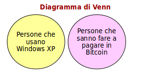

## Dark Web

Il Bitcoin è, sfortunatamente, fortemente associato al Dark Web.

Nel commercio B2C può essere venduto:
* **Oggetto fisico** (droghe, armi)
    *Problema ausiliario del delivery
* **Servizio** (hacking, bounty killer)
    * Esecuzione del servizio e conferma
* **Valore intrinseco** (intelligence, materiale copyright)
    * Delivery immediato in internet

Inoltre il Bitcoin permette:
* Non tracciabilità (condizionale) delle transazioni
* Evasione fiscale
* Riciclaggio
* Ransomware

