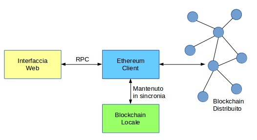
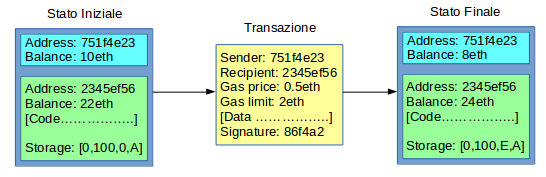

## Proprietà

### Lo Stack

Il client ethereum è in connessione continua con la rete distribuita di nodi ethereum e mantiene in sincronia una copia locale del blockchain.

Il client espone un'interfaccia RPC (_Remote Procedure Call_) accessibile da client web tramite la libreria `web3.js` (Javascript).

### Macchina a Stati

Ethereum è una macchina a stati basata su transazioni.

