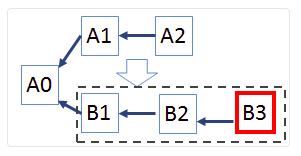
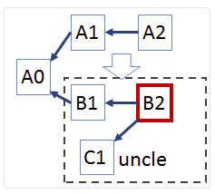

## Consenso

Il Meccanismo di consenso è basato su **GHOST** (_Greedy Heaviest Observed SubTree_), un algoritmo di _Zohar_ e _Sompolinski_, progettato per minimizzare il numero di **Stale Blocks**.

E' comunque un metodo nella categoria **Proof of Work**.

Gli Stale Blocks, in Ethereum chiamati **Uncle** o **Ommer** vengono inclusi nel Blockchain. Il ramo con più blocchi vince, anche se qualcuno è un _uncle_, perchè evidentemente ha generato più sforzo, anche se non di successo.

In Bitcoin il ramo più lungo vince:

In Ethereum il ramo più pesante vince:

Vi sono svariate obiezioni a questo metodo: gli uncles appesantiscono il blockchain, inoltre qualche miner può essere tentato a trovare uncles anzichè blocchi validi.

Sono stati introdotti correttivi per limitare la proporzione di uncles nel blockchain e per disincentivare i miners.
