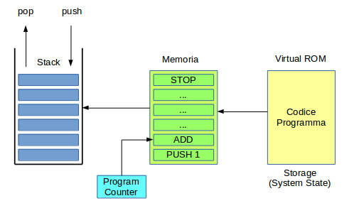

## Ethereum Virtual Machine (EVM)

E' l'interprete per i contratti intelligenti ed il suo ambiente di esecuzione. Ogni transazione è un contratto.

I programmi per la EVM sono scritti in bytecode. Vengono eseguiti in un **Sandbox** , indipendenti da altri programmi.



Proprietà della EVM:
* basata su **stack** LIFO (_Last In First Out_)
* parole da 256 bit, 1024 sullo stack
* big-endian
* codice ospitato in **Virtual ROM** e copiato in memoria al momento dell'esecuzione
* è associato un Program Counter per l'istruzione corrente
* Turing-complete
    * memoria e risorse limitate dal _gas_ disponibile

Due tipi di storaggio:
* **memory** - byte array, parole da 256 bit, ripulito al termine di ogni esecuzione
* **storage** - word array basato su chiavi e valori da 32 bytes, permanente, conservato nel blockchain

E' allo studio usare come bytecode il **WASM** (_Web Assembly_), iniziativa di Google, Mozilla e Microsoft.

### Parametri di Esecuzione della EVM

E' mantenuto un ambiente di esecuzione costituito di:
* Indirizzo del possessore del codice
* Indirizzo del mittente
* Prezzo del Gas
* Dati di input delle transazione
* Indirizzo dell'iniziatore della transazione
* Valore in Wey
* Bytecode
* Testata del blocco
* Profondità di chiamata del messaggio
* _System State_ iniziale
* Gas disponibile

Il risultato della transazione è:
* _System State_ finale
* Gas rimanente dopo la transazione
* Insieme _self destruct_ o _suicide_
* _Log Series_
* Rimborso Gas

### Machine State

La EVM mantiene lo stato di esecuzione corrente, in continuo cambiamento, composto di:
* Gas disponibile
* Program Counter
* Contenuto della Memoria
* Numero di parole nello stack
* Contenuto dello stack

La EVM può emettere delle eccezioni che causano la terminazione del programma, p.es. Gas insufficiente, stack overfolw, istruzione illegale, ecc.
In tal caso il gas usato finora è rimborsato.

Il programma può terminare anche con istruzioni di `STOP`, `SUICIDE`, `RETURN` e `SELF_DESTRUCT`.

### Esempio di Programma

In **Solidity**:
```
pragma solidity ^0.4.0; 
contract Test1
 { 
    uint x=2; 
    function addition1(uint x) returns (uint y) { 
    y=x+2; 
 } 
}
```
Convertito in **Bytecode**:
```
PUSH1 0x60 PUSH1 0x40 MSTORE PUSH1 0x2 PUSH1 0x0 SSTORE CALLVALUE PUSH1 0x0 JUMPI JUMPDEST PUSH1 0x45 DUP1 PUSH1 0x1A PUSH1 0x0 CODECOPY PUSH1 0x0 RETURN PUSH1 0x60 PUSH1 0x40 MSTORE PUSH1 0xE0 PUSH1 0x2 EXP PUSH1 0x0 CALLDATALOAD DIV PUSH4 0x989E1731 DUP2 EQ PUSH1 0x1C JUMPI JUMPDEST PUSH1 0x0 JUMP JUMPDEST CALLVALUE PUSH1 0x0 JUMPI PUSH1 0x29 PUSH1 0x4 CALLDATALOAD PUSH1 0x3B JUMP JUMPDEST PUSH1 0x40 DUP1 MLOAD SWAP2 DUP3 MSTORE MLOAD SWAP1 DUP2 SWAP1 SUB PUSH1 0x20 ADD SWAP1 RETURN JUMPDEST PUSH1 0x2 DUP2 ADD JUMPDEST SWAP2 SWAP1 POP JUMP
```


