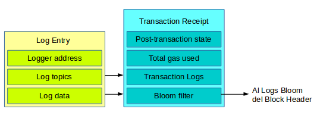

## Ricevute di Transazione

Sono prodotte dopo ogni transazione, e mantenute in un Trie indicizzato.
Lo hash del trie è un campo del blocco.

I campi sono:
* Stato seguente alla transazione
* Gas usato dalla transazione
* Items di Log - generati dalla transazione
* Bloom filter dei log

Un Bloom filter è una struttura probabilistica che indica se un elemento è parte di un insieme. Qui serve a indicare se un determinato elemento di log è presente nella lista dei log.

I Bloom filter velocizzano la query di dati senza ricorrere ad un'indicizzazione piena.
