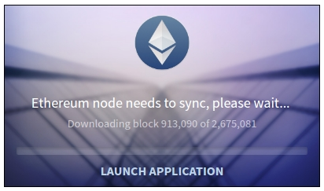

## Mist

Mist è un client per desktop, GUi e intenzionalmente amichevole, che permette di:
* gestire gli account
* gestire i contratti
* eseguire transazioni

All'atto dell'installazione, alla prima attivazione, Mist impiega un tempo considerevole per scaricare il Blockchain Ethereum dalla rete - sicuramente ore e forse giorni.

