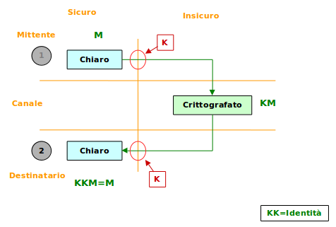

## Crittografia Simmetrica

Concetto tradizionale di chiave. La stessa chiave crittografa e decrittografa un messaggio.

La crittografazione può essere:
* **stream cypher** - ugni byte è crittografato singolarmente
* **block cypher** - un blocco di bit è l'unità che viene crittografata, tipicamente 64 bit

La _stream cypher_ è considerata poco sicura è non è più praticamente usata.

La crittografazione è composta da due aspetti:
* **algoritmi**
* **chiavi**

I principali argoritmi di _stram cypher_ sono basati sul modello di **Feistel** e sono una combinazione delle operazioni di sostituzione e permutazione, compiute in un certo numero di cicli.

La chiave fornita serve per derivare delle **sottochiavi**, ciascuna delle quali partecipa alla crittografazione in un ciclo.

La decrittografazione è ottenuta semplicemente applicando le sottochiavi in sequenza inversa a quella della crittografazione.
