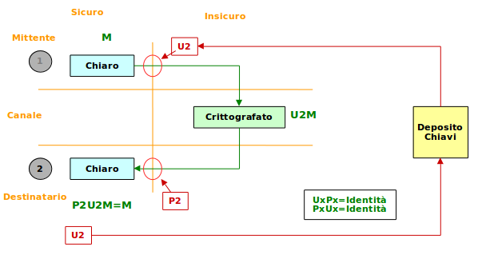
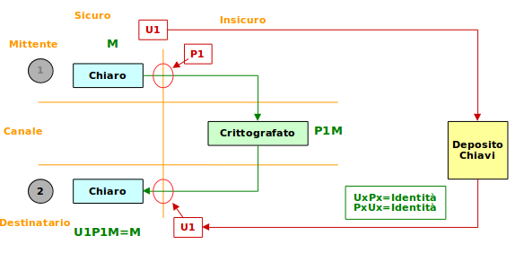

## Crittografia Asimmetrica

Le chiavi asimmetrichè sono ottenute con alcuni - pochi - metodi diversi, tra cui:

* fattorizzazione di numeri prodotto di due numeri primi molto grandi
* uso delle proprietà delle _curve ellittiche_

Le chiavi asimmetriche vanno a coppia: una è usata per crittografare il messaggio, l'altra per decrittografarlo.

Una delle due chiavi è detta **pubblica** e deve essere disponibile a tutti. L'altra è detta **privata**, e deve esservi l'assicurazione che solo il proprietario vi può accedere.

L'eventuale compromissione della chiave privata inficia qualsiasi operazione di crittografia compiuta con la coppia di chiavi.

Una chiave pubblica è quindi un **identificativo**, associato ad una persona, ad un server, ad un indirizzo di criptovaluta, ecc.

Vi sono due scenari di utilizzo delle chiavi doppie.

#### Confidenzialità del messaggio

#### Assicurazione di provenienza

